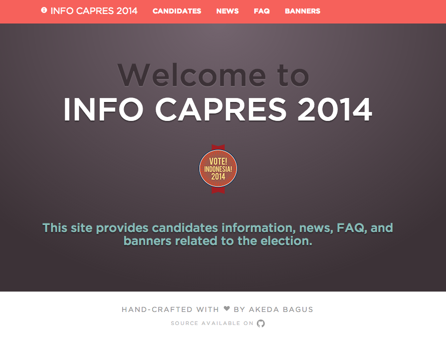

Info Capres 2014
================

SPA (Single Page Application) powered by Backbone.js. Data is consumed from
[pemiluapi](http://developer.pemiluapi.org/).

[Live demo](http://gedex.web.id/info-capres-2014) from GitHub page.

## Screenshot



## Build

```
$ npm install # for the first time
$ grunt
```

In case you don't have Grunt installed, the `dist` directory contains the build files.

## Deploy to GitHub Page

```
$ grunt gh-pages
```

Build will be available on `dist` directory.

## License

MIT License - see [LICENSE](./LICENSE) file.
